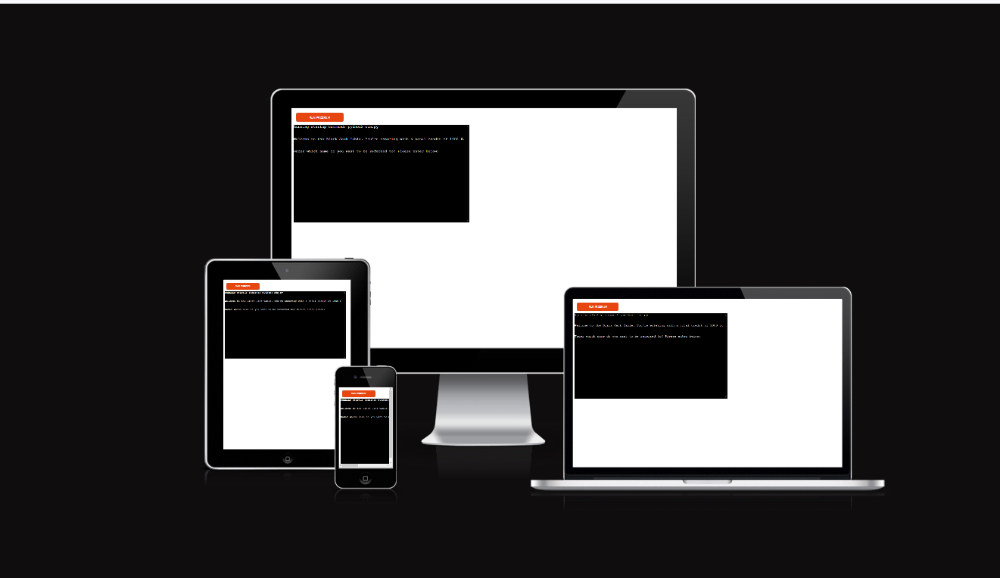

# Description

Welcome to the Blackjack Terminal Game, an interactive Python implementation of the classic casino card game Blackjack. Step into the virtual casino and test your luck and strategy in this command-line based blackjack experience. 

[Here is the live version of my Project](https://arp-25-blackjack-bda49c45fd8c.herokuapp.com/)

## Game Overview
In this game, you'll find the fundamental components of a blackjack game, including the deck of cards, participants like the player and dealer, betting system, and rounds of play. The player can place bets, draw cards, and compete against the dealer to win rounds and increase their credits.

[Wikipedia Black Jack](https://de.wikipedia.org/wiki/Black_Jack) 

## Key Features
- F01 Card Representation
    - Detailed card representation, including:
        - Symbol: Represents the suit of the card (Hearts, Diamonds, Clubs, Spades).
        - Value: Numerical value or face value of the card (e.g., 2, 3, King).
        - Logo: Distinct identifier for the card (e.g., Ace, King, Queen).
- F02 Deck Management
    - Deck Creation: A functional deck of 52 standard playing cards created at the start of the game.
    - Shuffling: Random shuffling of the deck to ensure fair gameplay.
    - Card Drawing: Ability to draw cards from the deck during the game.
- F03 Participant Roles
    - Player: Interactive representation of the player with their own hand and actions.
    - Dealer: Interactive representation of the dealer with specific gameplay rules.
- F04 Betting System
    - Bet Placement: Prompted to place a bet at the beginning of each round.
    - Bet Validation: Ensures bets are valid and within the available credits.
- F05 Interactive Gameplay
    - Player Actions: Interact with the game by choosing actions such as drawing cards or deciding to stop.
    - Game Flow: Guided gameplay flow with step-by-step instructions and user prompts.
- F06 Winning and Losing
    - Hand Comparison: Compare hand values to determine round winners, losers, or draws.
    - Credit Adjustments: Modify player credits based on the round outcome.
- F07 Credit Tracking
    - Credit Balance: Continuously track and display the player's remaining credits.
    - Credit Management: Update credits based on wins, losses, and bet placements

## Getting Started
To start playing, simply click this [link](https://arp-25-blackjack-bda49c45fd8c.herokuapp.com/) or run the Python script provided in this repository. Follow the on-screen instructions to begin a round of Blackjack. 

## How to Play
- Place Your Bet: At the start of each round, you'll be prompted to place a bet using the available credits.

- Draw Your Cards: Receive two initial cards. Decide if you want to draw more to improve your hand, aiming to get as close to 21 as possible without exceeding it.

- Dealer's Turn: Once you've completed your turn, the dealer will draw cards according to the rules until a winner is determined.

- Win or Lose: The round's winner will be announced based on the hand values. Credits are adjusted accordingly.

- Keep Playing: Choose to continue playing additional rounds or leave the table.

## Data Model
The Blackjack game project comprises the following essential classes and their functions:

- Card Class
    - Responsible for card representation.
    - Attributes: Symbol, Value, Logo.
    - Methods: Card initialization, string representation.
- Deck Class
    - Manages the deck of cards.
    - Methods: Deck initialization, card shuffling, card drawing.
- Participant Classes
    - Represent player and dealer in the game.
    - Manage participant actions, hands, and values.
    - Methods: Hand management, value calculation.
- Player Class
    - Inherits from Participant.
    - Manages player-specific actions like placing bets and credit management.
- Dealer Class
    - Inherits from Participant.
    - Manages dealer's actions and hand display.
    - The data model forms the core structure, managing cards, participants, and gameplay actions within the Blackjack game.

## Testing

### Testing Approach

I have conducted a comprehensive testing approach to ensure the functionality and reliability of this project. The testing process involved both manual testing, where I interacted with the application directly, and unit tests to validate individual components.

### Manual Testing

I meticulously tested various aspects of the application manually, engaging with different functionalities and scenarios. This involved simulating user interactions and verifying that the application behaves as expected. The manual tests encompassed critical game features, user input validations, edge cases, and overall application behavior.

### Unit Tests

To ensure the robustness and correctness of the codebase, I implemented a suite of unit tests. These tests target specific units of the code, such as functions and methods, to validate their accuracy and reliability. The unit tests cover a range of functionalities and ensure that each component performs its designated task correctly.

### Test Screenshots
Below, you will find a screenshot showcasing the results of the unit tests. These visual representations provide insights into the testing efforts and demonstrate the project's reliability and adherence to expected behaviors.

### Validator Testing

#### To ensure adherence to PEP 8 style conventions and maintain consistent code formatting, we've integrated Pylint and Flake8 as PEP 8 validators in this project.

- Pylint:
Pylint, a widely-used Python linter, helps maintain a high level of code quality by checking for adherence to PEP 8 guidelines and more. It has been installed and configured to provide valuable insights into code style and potential errors.

- Flake8:
Flake8 is another powerful tool that encompasses PEP 8 style checking along with additional plugins for code analysis. It has also been installed to further enforce and validate the code against PEP 8 standards.

By leveraging both Pylint and Flake8, I aim to promote clean, readable, and consistent code throughout the development process.

## Deployment

This project was deployed using Code Insititute's Mock terminal for Heroku.

- Steps for deployment:
    - Fork or clone this repository
    - Create a new Heroku App
    - Set the buildback to Python and NodeJS in that exact order
    - Link the Heroku App to the repository
    - Click on Deploy

## Credits

- Code Institute for the deployment terminal
- Femi, my Mentor. For giving me advice whenever I ask him
